# Markos Artisan

> Evidence-first outbound intelligence — understand the sender, analyze the target, choose the right angle, and draft emails you can actually defend.

Markos Artisan is an AI outbound workflow scoped for a coherent end-to-end path: one workflow from sender research through verified email drafts, rather than a demo that only generates copy.

The bet is simple. Outbound breaks when the system skips understanding *who is sending*, *who they sell to*, and *why this target should care*. Email copy is the last step — not the product.

---

## What it does

Markos Artisan is an AI outbound workflow that:

1. **Researches a sender** from a homepage URL — crawls public pages, extracts observations, and synthesizes an ICP plus multiple value propositions.
2. **Suggests target companies and personas** that fit the sender profile (optional; you choose whether to pursue them).
3. **Lets you add targets manually** — URL + role + seniority — when you already know who you want to reach.
4. **Analyzes each target separately** — fresh crawl, fit assessment, persona alignment, and two outreach angles.
5. **Selects the most relevant value proposition** for that specific target and persona.
6. **Drafts two emails** — pain-led and trigger-led — grounded in sender context, target evidence, and strategy.
7. **Runs an independent email guardrail** — a separate verification step that checks whether each factual claim in the email is actually supported by cited evidence. Unsafe emails get one regeneration pass.

This is not a generic “paste a URL, get an email” tool. The interesting part is the chain: sender understanding → target fit → VP selection → strategy → copy → verification.

---

## Product walkthrough

### 1. Start with a sender URL

The home page is intentionally minimal. Paste a company website and start sender research. Recent campaigns stay in the sidebar for quick re-entry.

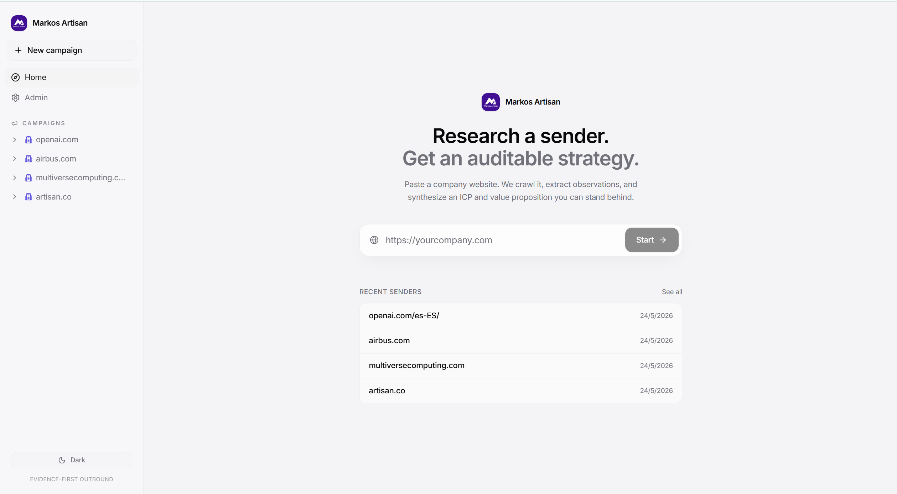

---

### 2. Watch sender analysis run

Long-running agent steps are visible, not hidden behind a spinner. The UI streams progress over SSE and shows each stage — crawl, sectioning, extraction, NLI validation, planner review, ICP synthesis, value propositions, and target discovery — with live counts (pages fetched, observations extracted, and so on).

In this run against `multiversecomputing.com`, the planner chose `fetch_more` after the first pass because evidence was thin on a few ICP fields. That is deliberate: one bounded agentic decision, not an open-ended loop.

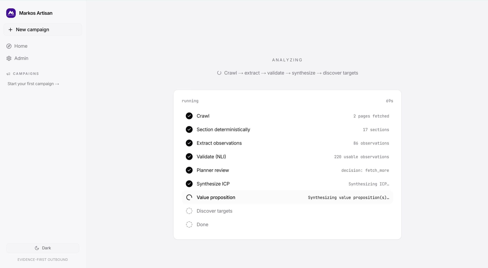

---

### 3. Review the ICP

Sender output starts with a structured **Ideal Customer Profile**. Every field — industries, size bands, likely buyers, common triggers, negative ICP — carries a confidence score and links back to the observations that support it. You can expand evidence inline instead of trusting a black-box summary.

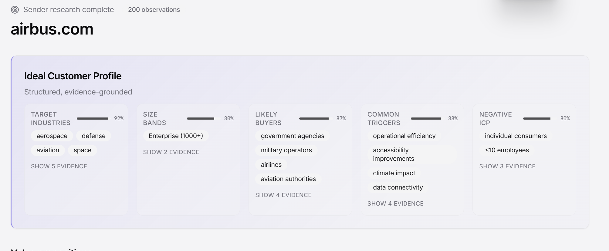

---

### 4. Review value propositions

The sender rarely has just one story. When the site supports it, the system extracts **multiple value propositions** — distinct customer / pain / outcome / mechanism lines, each anchored to evidence refs. VP #1 is always the general company-level fallback; narrower VPs are used when a target clearly matches a specific line of business.

These VPs matter downstream: during target analysis, the strategy step **selects the best-fitting VP** for that company and persona before writing anything.

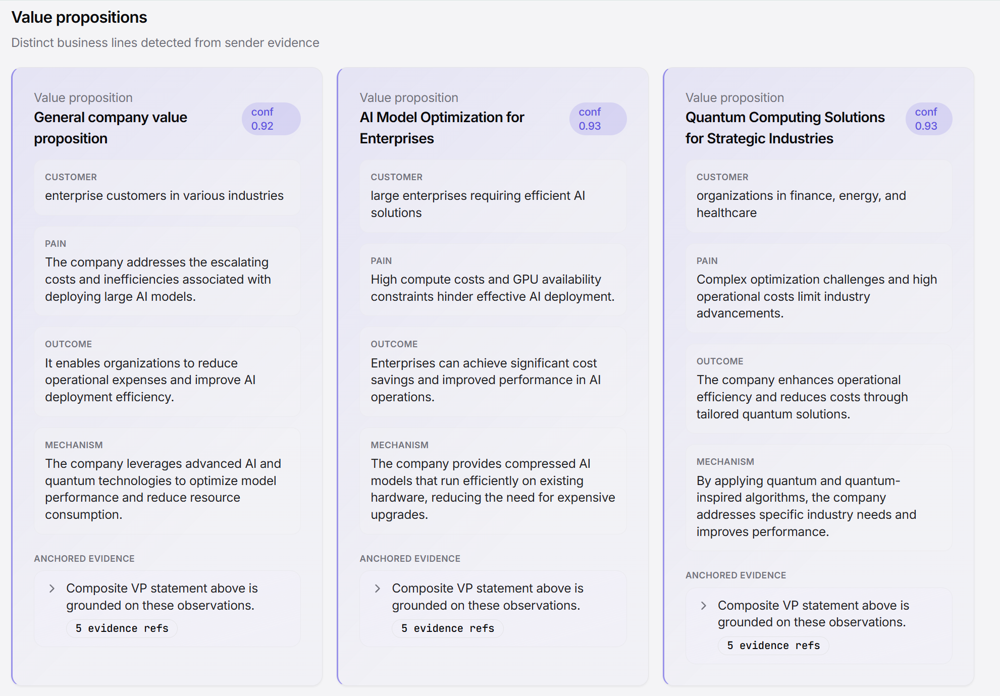

---

### 5. Pick a target — suggested or manual

After sender research completes, the workflow moves to target selection. Two paths:

- **Suggested targets** — the backend runs a bounded web search against the sender ICP/VP and returns up to 3 candidate companies, each with up to 2 suggested personas. Suggestions are **opt-in**: saving or evaluating a target is an explicit user action. Nothing auto-starts downstream analysis.
- **Manual target** — enter any target URL, role, and seniority directly (e.g. `volotea.com`, VP of Sales) and kick off evaluation yourself.

Both paths converge on the same target pipeline.

---

### 6. Target analysis — fit, persona, and strategy

For each target, the system crawls the target site, validates observations, and (when the planner allows) optionally enriches with public web search. Strategy synthesis produces:

- **Fit assessment** — strong / plausible / weak / none, with reasons, risks, and missing evidence called out explicitly.
- **Persona alignment** — how to frame the message for the chosen role and seniority, including what to avoid.
- **Two outreach angles** — pain-led and trigger-led — each tied to specific target observation IDs.
- **Selected value proposition** — the VP that best matches this target, with a one-sentence selection reason.

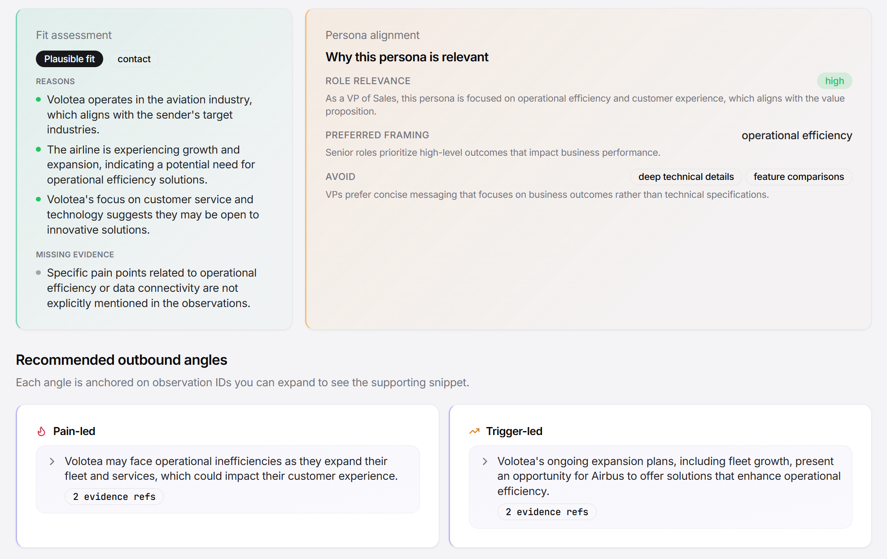

---

### 7. Pipeline visibility on the target run

The Admin / metrics view exposes the same stage timeline the user sees during execution. This matters for an agentic system: you can inspect planner decisions, guardrail outcomes, angle overlap scores, token usage, and cost per step.

In this Volotea run, the planner chose `continue`, both emails passed the guardrail (one required regeneration), and angle overlap landed at 0.82.

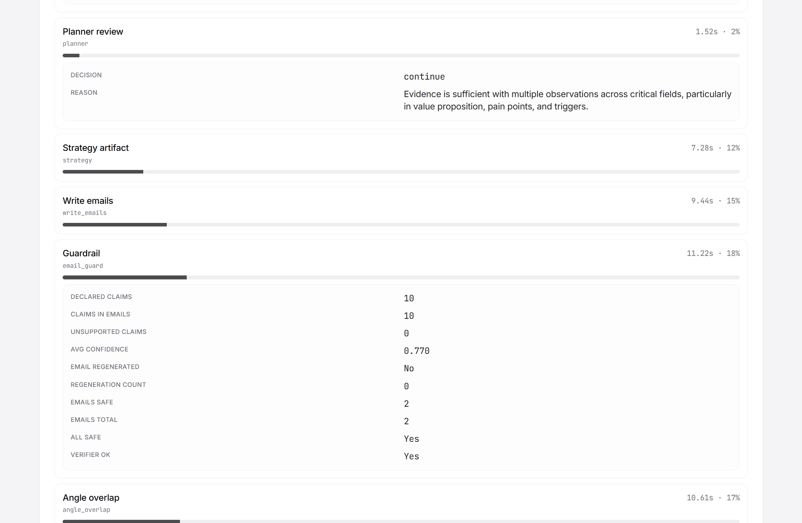

---

### 8. Generated emails

The outreach step produces two send-ready drafts — **pain-led** and **trigger-led** — with the selected VP, fit level, and contact decision surfaced above the copy. Emails are visually separated from the analysis sections because they are the deliverable.

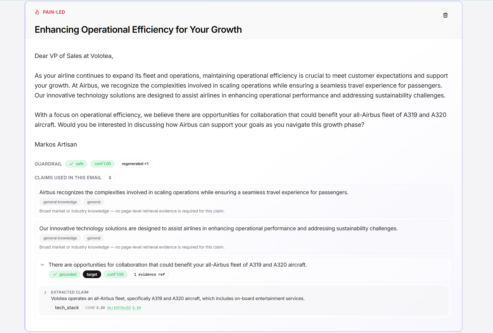

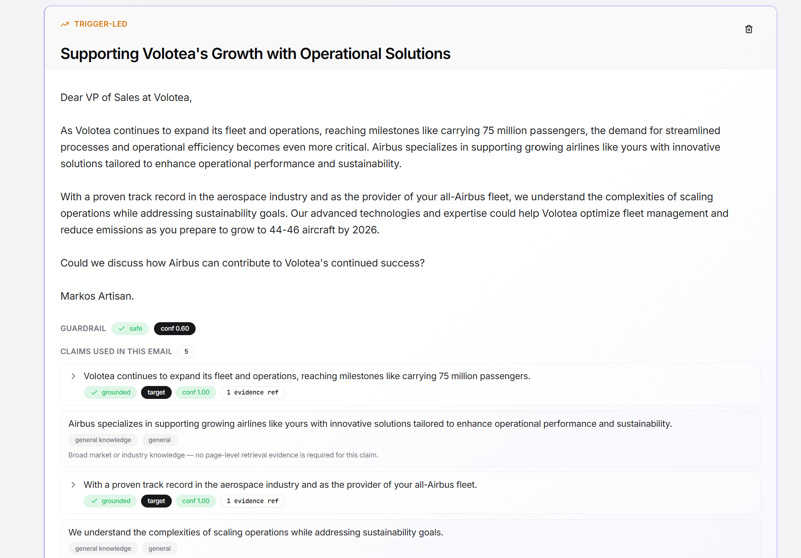

---

### 9. Email guardrail — evidence you can inspect

The guardrail is a **separate step from the writer**. The writer must declare every factual claim it used (`general`, `sender`, or `target` scope) and cite evidence refs from a shared context index. The guardrail then judges each claim independently: does the cited evidence actually support what the email says?

Sender/target claims with no evidence are rejected deterministically — even if the writer was optimistic. If any claim fails, the email is regenerated once and re-judged. The UI shows per-claim status, confidence, and expandable source snippets (including NLI validation scores on the underlying observations).

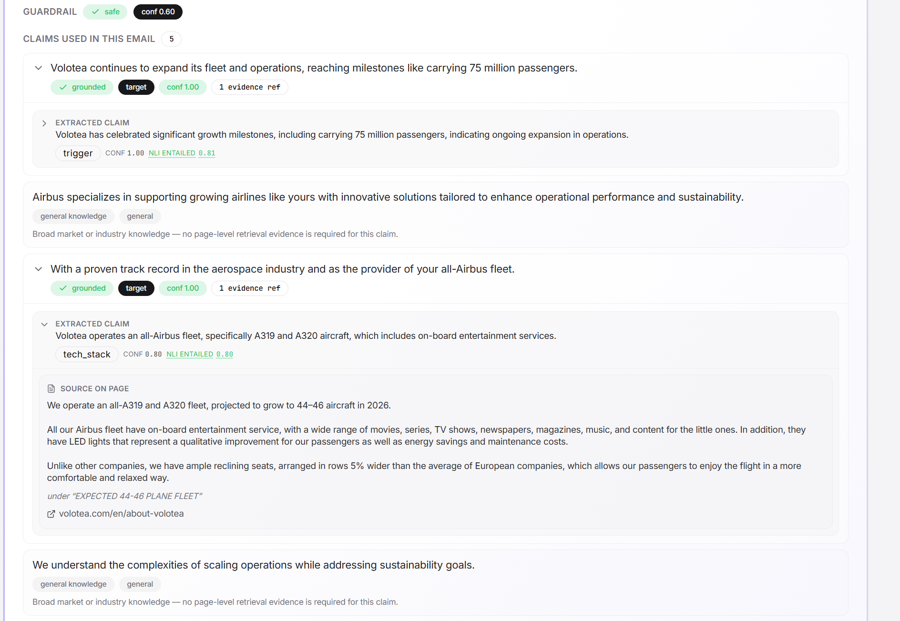

---

### 10. Run analytics

Every pipeline execution is logged to MLflow and persisted in SQLite. The Admin view summarizes latency, token/cost breakdown by LLM purpose, observation validation rate, guardrail outcomes, and angle overlap — useful for comparing runs and spotting where quality or cost drifts.

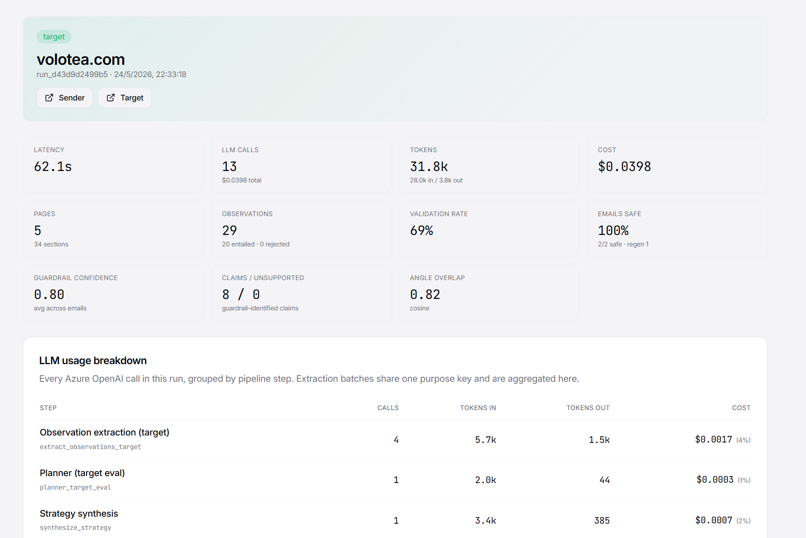

---

## Core workflow

```mermaid
flowchart TB
  subgraph SENDER["Sender"]
    S1[URL] --> S2[crawl]
    S2 --> S3[extract]
    S3 --> S4[validate NLI]
    S4 --> S5{planner}
    S5 -->|fetch_more max once| S2
    S5 -->|continue| S6[synthesize ICP + VPs]
    S6 --> S7[discover suggested targets]
    S7 --> S8[done]
  end

  subgraph TARGET["Target (per target + persona, user-triggered)"]
    T1[URL] --> T2[crawl]
    T2 --> T3[extract]
    T3 --> T4[validate]
    T4 --> T5{planner}
    T5 -->|web_search optional| T6[enrich]
    T6 --> T7[strategy]
    T5 -->|continue| T7
    T5 -->|stop| T8[skip with explicit refusal]
    T7 --> T9[write 2 emails]
    T9 --> T10[guardrail judge + optional regen]
    T10 --> T11[angle overlap check]
    T11 --> T12[analytics]
    T12 --> T13[done]
  end
```

**Separation of concerns:** discovery, target analysis, strategy, email writing, and email verification are distinct stages. Suggested targets do not auto-trigger target analysis. The guardrail does not reuse the writer’s self-assessment.

---

## Key product decisions

**Visible workflow over magic.** Agentic systems take time. Showing stages, counts, and planner decisions keeps the user oriented and makes failures debuggable instead of mysterious.

**Understand the sender first.** ICP and multiple VPs are first-class artifacts. Email generation only happens after both sender and target have been researched.

**VP selection is per-target.** The strategy step picks the narrowest VP that fits — or falls back to the general company VP — and explains why. Two targets for the same sender can get different VPs and angles.

**Suggestions are optional.** Target discovery closes the loop after sender research, but the user decides what to evaluate. No silent auto-runs.

**Refusal is a feature.** If evidence is too thin, the planner returns `stop` and the target flow ends with `fit_level = none` / `contact_decision = skip` rather than inventing a strategy.

**One regeneration, not a loop.** Email guardrail and angle-overlap repair each run at most once. Bounded repair keeps behavior auditable.

---

## Architecture overview

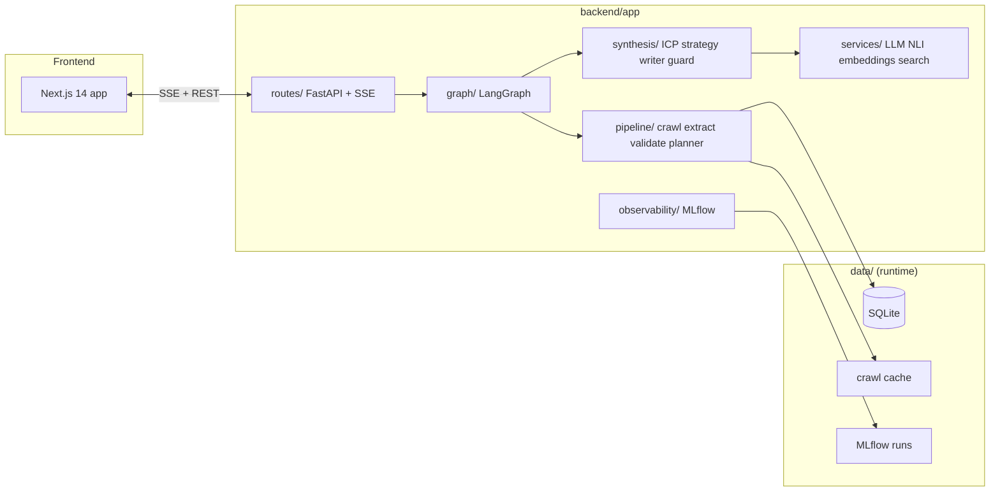

| Area | Role |
| --- | --- |
| `frontend/` | Next.js 14 app — multi-step workflow, SSE progress, evidence UI |
| `backend/app/graph/` | LangGraph state machines (sender_graph, target_graph) |
| `backend/app/pipeline/` | crawl, extract, validate, planner |
| `backend/app/synthesis/` | sender ICP/VP, strategy, writer, email_guard, target_discovery |
| `backend/app/services/` | LLM (Instructor + Azure OpenAI), NLI, embeddings, web search |
| `backend/app/observability/` | MLflow run tracking + per-stage metrics |
| `backend/app/routes/` | FastAPI endpoints + SSE streams |
| `data/` | SQLite, crawl cache, MLflow runs (bind-mounted in Docker) |

**Orchestration:** LangGraph with typed shared state. Business logic lives in `pipeline/` and `synthesis/`; graph nodes are thin wrappers.

**Evidence model:** Pages are crawled with `httpx` + `trafilatura` (Playwright fallback for thin JS-rendered pages). Markdown is sectioned deterministically; `section_id = sha1(url, heading, char_start)`. The extractor can only cite existing section IDs — invented refs are rejected.

**Single agentic decision point:** The Planner runs after validation and can choose `continue`, `fetch_more`, `web_search`, `proceed_low_confidence`, or `stop`. No open-ended ReAct loops.

**Structured LLM I/O:** Instructor + Pydantic on every synthesis call. Schema failures retry internally.

**No vector DB.** At ~10 pages and ~50 sections per run, an in-memory context index keyed by ref ID is faster and fully auditable.

---

## Agent pipeline (backend)

### Sender graph

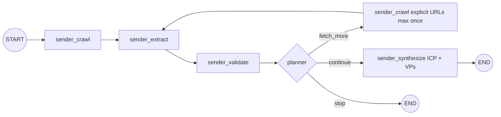

Post-graph, `discover_targets()` runs a bounded web search to suggest ICP-fit companies (best-effort; returns structured empty state on failure).

### Target graph

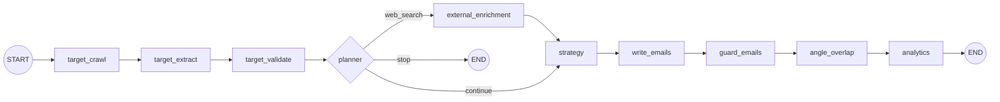

**NLI validation** (`cross-encoder/nli-deberta-v3-xsmall`) runs on observations during extraction — selectively skipped for low-risk, high-confidence kinds (pricing, tech stack) and always applied to inferred/high-risk kinds (pain, triggers, funding). Email claims are **not** NLI-scored directly; the email guardrail uses a separate LLM judge.

**External search** is behind a typed `ExternalSignalProvider` abstraction (`disabled` by default; `openai_web_search` via Azure OpenAI Responses API when enabled). Only the target flow can trigger it, and only when the planner says so.

---

## Email safety / evidence guardrail

The guardrail is intentionally **independent from the writer**:

1. The **writer** produces subject + body and declares `claims_used` — factual snippets tagged as `general`, `sender`, or `target`, each with `evidence_refs` pointing into a shared context index (observations, VP fields, strategy angles).
2. Claims are **hydrated** with the actual snippets the writer cited.
3. The **guardrail judge** (separate LLM call, temperature 0) receives only the email body and the declared claims with their cited evidence. It returns `grounded: bool` + confidence + reason per claim. It does not re-read the full briefing or invent new claims.
4. **Deterministic checks** override optimistic judge output: sender/target claims with zero evidence are always ungrounded.
5. If any sender/target claim fails → **one regeneration** with the failing claims flagged, then re-judge. After that, the result stands (safe or not).

The UI surfaces this as expandable claim cards with evidence popovers — so a reviewer can see exactly what the email asserted and what backed it up.

---

## Tech stack

| Layer | Choice |
| --- | --- |
| Backend | FastAPI, LangGraph, Instructor, Pydantic |
| LLM | Azure OpenAI (`gpt-4o-mini` default; `gpt-4o` for email writing) |
| Crawling | `httpx`, `trafilatura`, `selectolax`, lazy `playwright` (Chromium) |
| Observation validation | `sentence-transformers` CrossEncoder NLI (DeBERTa-v3-xsmall, CPU) |
| Embeddings | `all-MiniLM-L6-v2` (angle overlap measurement) |
| Storage | SQLite (provenance + run history) + on-disk HTML cache (`sha256(url)`) |
| Observability | MLflow (file backend) |
| External search | Azure OpenAI Responses API `web_search` tool (optional) |
| Frontend | Next.js 14, React 18, TanStack Query, Tailwind, Radix UI, Framer Motion |
| Streaming | Server-Sent Events for live stage updates |

---

## How to run locally

### Docker (recommended)

```bash
cp .env.example .env
# set AZURE_OPENAI_API_KEY and AZURE_OPENAI_ENDPOINT in .env

docker compose up --build
```

Then open:

- **App:** http://localhost:3000
- **API docs:** http://localhost:8000/docs
- **MLflow:** http://localhost:5000

The backend image uses `mcr.microsoft.com/playwright/python` and pre-downloads NLI + embedding models at build time so the first request is not cold-start painful.

### Local dev (no Docker)

```bash
# backend
cd backend
python -m venv .venv
.venv\Scripts\activate          # macOS/Linux: source .venv/bin/activate
pip install -r requirements.txt
playwright install chromium     # only if not using the Playwright base image
uvicorn app.main:app --reload --port 8000

# frontend (new shell)
cd frontend
npm install
npm run dev
```

Set `BACKEND_URL=http://localhost:8000` for the frontend if you are not using the built-in Next.js API proxy in production mode.

Health check:

```bash
curl http://localhost:8000/api/v1/health
```

---

## Environment variables

| Variable | Required | Default | Purpose |
| --- | --- | --- | --- |
| `AZURE_OPENAI_API_KEY` | yes | — | Azure OpenAI API key |
| `AZURE_OPENAI_ENDPOINT` | yes | — | Azure OpenAI endpoint URL |
| `AZURE_OPENAI_API_VERSION` | no | `2024-10-21` | Chat completions API version |
| `AZURE_OPENAI_RESPONSES_API_VERSION` | no | `2025-03-01-preview` | Responses API (web search) version |
| `LLM_MODEL` | no | `gpt-4o-mini` | Default deployment name |
| `WRITER_LLM_MODEL` | no | `gpt-4o` | Email writer deployment |
| `WEB_SEARCH_MODEL` | no | same as `LLM_MODEL` | Web search deployment |
| `EXTERNAL_SIGNAL_PROVIDER` | no | `disabled` | `disabled` or `openai_web_search` |
| `DATA_DIR` | no | `data` | Runtime data root |
| `DB_PATH` | no | `data/artisan.db` | SQLite path |
| `CRAWL_CACHE_DIR` | no | `data/crawl` | HTML cache directory |
| `MLFLOW_TRACKING_URI` | no | `file:./data/mlruns` | MLflow backend |
| `CORS_ORIGINS` | no | `http://localhost:3000` | Allowed frontend origins |

See [`.env.example`](.env.example) for the full list of tunables.

---

## Known limitations / future improvements

- **Target discovery quality varies.** Web search suggestions depend on public index freshness and the sender’s ICP specificity. Weak matches return a clean empty state, but ranking could be tighter.
- **Single crawl pass on targets.** Sender flow can `fetch_more` once; target flow is capped at one pass by design (latency trade-off). Some SPAs still need better Playwright heuristics.
- **Guardrail trusts declared claims.** The judge verifies whether cited evidence supports each writer-declared claim — it does not independently re-extract claims from the email body. A second extraction pass would catch claims the writer “forgot” to declare.
- **No send integration.** This is research + drafting + verification, not a sequencer. Hooking into an ESP and tracking replies is out of scope for the current build.
- **Run retention is in-memory (10 min).** Artifacts persist in SQLite, but live SSE reconnection only works for recently finished runs. Long-lived run polling would be a small follow-up.
- **English-only.** Prompts, UI, and observation kinds assume English-language B2B sites.
